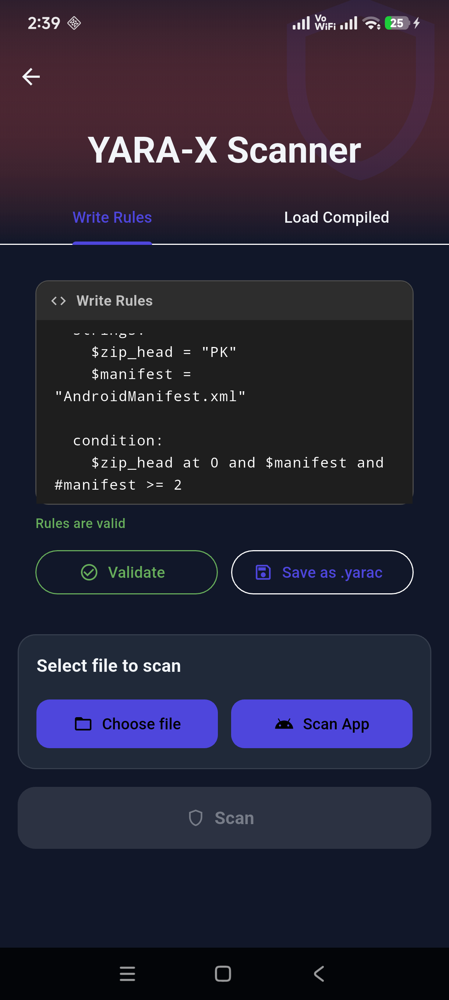
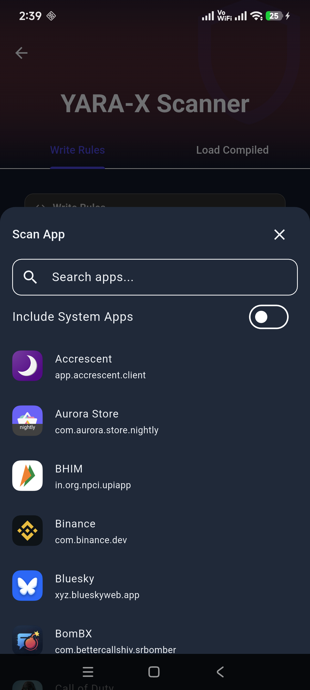
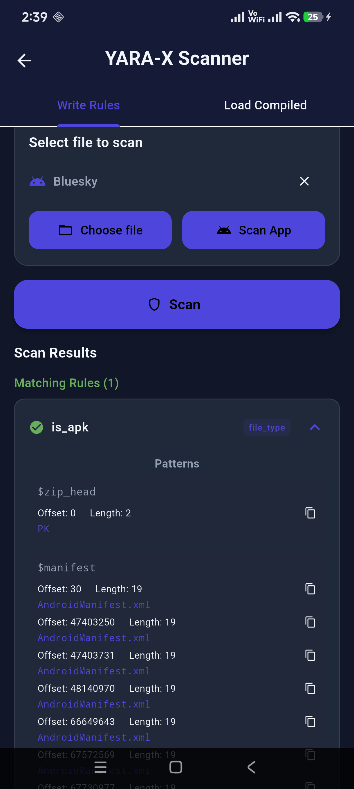

# yarax_android

The first Android implementation of yara-x. Native Android JNI bindings for yara-x.

## Screenshots

<p align="center">
  
  
  
</p>

## Usage

Add this project as a submodule to your Android project:

```bash
git submodule add https://github.com/AbhiTheModder/yarax_android.git
git submodule update --init --recursive
```

Then apply the dex patches to yara-x:

```bash
cd yarax_android/yarax_patches
make update-yarax
```

You're good to go!

For a live example, check out [revengi-app](https://github.com/RevEngiSquad/revengi-app).

## License

BSD 3-Clause — see [LICENSE](LICENSE).
